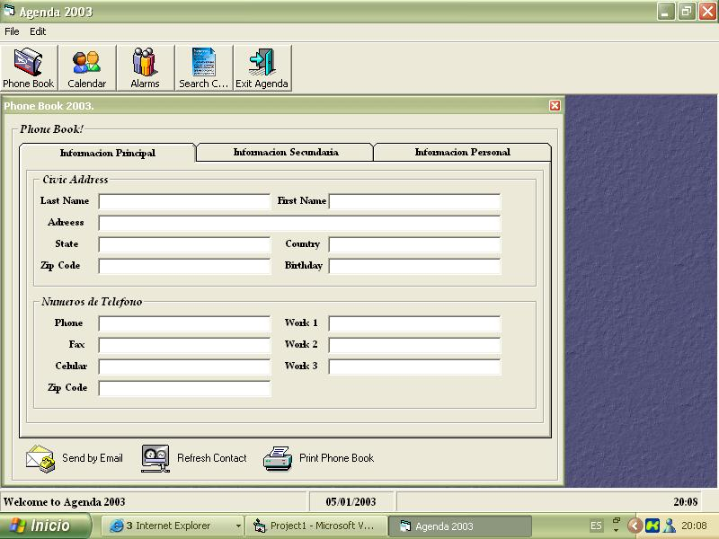



## A PhoneBook 2003

### Description

This PhoneBook is a complete aplication, you can send Emails, or Print your contacts, Alarms and Calendar Activities, also you can play MP3, store Businness, web pages, emails wife phone etc. If you find a bug please tell me to personalgjoc@hotmail.com.
 
### More Info
 

             |
---                |---
**Submitted On**   |2003-01-10 13:57:36
**By**             |[Pui Yiu Tam](https://github.com/Planet-Source-Code/PSCIndex/blob/master/ByAuthor/pui-yiu-tam.md)
**Level**          |Intermediate
**User Rating**    |4.1 (49 globes from 12 users)
**Compatibility**  |VB 6\.0
**Category**       |[Complete Applications](https://github.com/Planet-Source-Code/PSCIndex/blob/master/ByCategory/complete-applications__1-27.md)
**World**          |[Visual Basic](https://github.com/Planet-Source-Code/PSCIndex/blob/master/ByWorld/visual-basic.md)
**Archive File**   |[PhoneBook\_1527021102003\.zip](https://github.com/Planet-Source-Code/pui-yiu-tam-a-phonebook-2003__1-42312/archive/master.zip)

